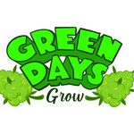

# Green Days GrowShop.

  

## Objetivos generales:

- Crear una aplicación usando Javascript, React, el kit de herramientas Redux, Node JS y Sequelize.
- Cumplir los objetivos pactados con el cliente.

## Tecnología utilizadas:

- [ ] React
- [ ] Redux Toolkit
- [ ] Express
- [ ] Sequelize - PostgresSQL
- [ ] JsonWebToken
- [ ] Bcrypt

##### BoilerPlate:

El contenido del `cliente` se creó usando: Create React App.

##### Objetivos de la aplicación:

Usuario:

- Comprar productos del negocio
- Poder filtrarlos por tipo de producto.

Administrador:

-Crear nuevos productos para ponerlos en la venta.
-Controlar stock.
-Agregar ventas diarias.

##### Contacto:

-marianoo.14.md@gmail.com

- https://www.linkedin.com/in/mariano-dunand/
